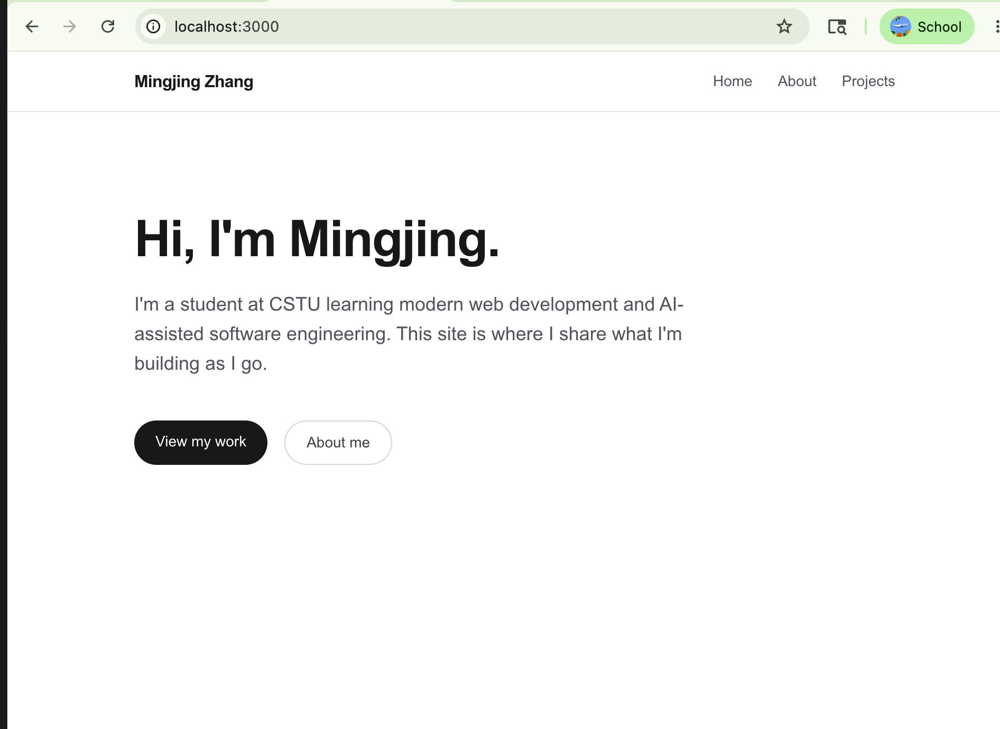
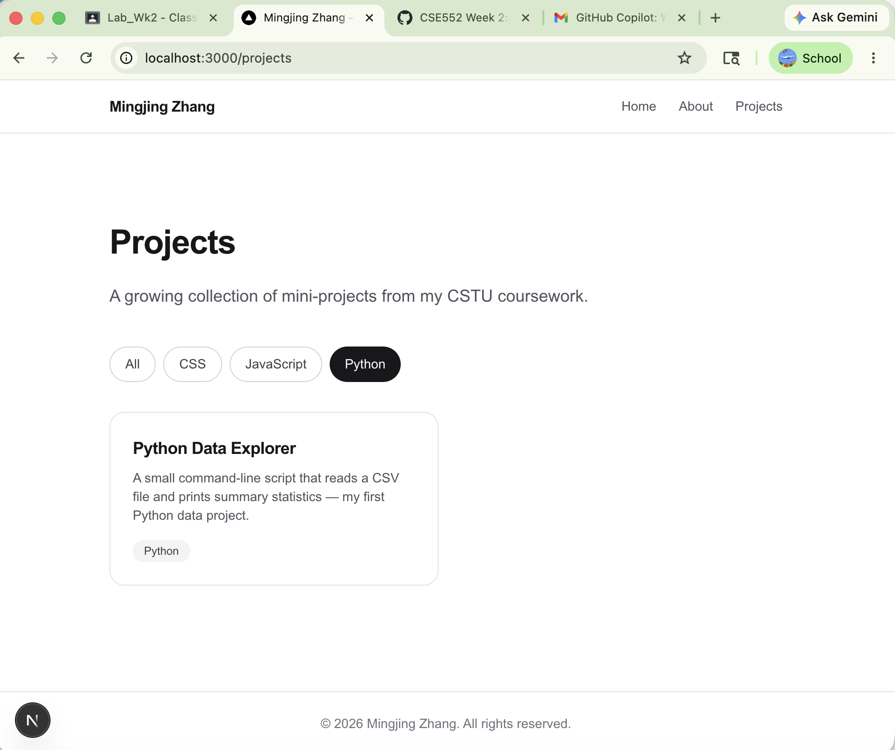

# Week 2 — Next.js Portfolio Site (Complete Submission)

**Student:** Mingjing Zhang  
**Course:** Full Stack Engineering — Week 2  
**GitHub repository:** https://github.com/mingjing-zhang/week-02-portfolio

### Screenshots folder (`screenshots/`)

| File | Description |
|------|-------------|
| `homepage.png` | Homepage at `/` — hero + nav + footer (**submission**) |
| `projects-python-filter.png` | Projects page with **Python** filter active, only the Python card visible (**submission**) |
| `projects-all-filter.png` | Projects page with default `All` filter — all 4 cards visible (extra) |

---

## 1. GitHub repo link

https://github.com/mingjing-zhang/week-02-portfolio

**Commits (≥ 10, well above the ≥ 6 requirement)** — see `git log` for the complete history. The main work breakdown:

1. Initial commit from create-next-app
2. Add shared navigation layout, footer, and site metadata
3. Add homepage with hero section
4. Add About page with bio and skills list rendered with `.map()`
5. Add Projects page with `useState` filter and project cards
6. Extract `ProjectCard` into reusable component
7. Add submission screenshots (homepage + Projects with Python filter active)
8. Link real project cards to their GitHub repositories
9. Rename submission screenshots to clean filenames
10. Add SUBMISSION.md for turn-in

---

## 2. Screenshot — Homepage

**File:** `screenshots/homepage.png`

---

## 3. Screenshot — Projects page with filter active

**File:** `screenshots/projects-python-filter.png`

The **Python** filter button is highlighted as the active state. Only the project tagged `Python` is rendered, demonstrating that the `useState`-driven filter correctly narrows the visible cards.

---

## 4. Rubric checklist

| Criteria | Status | Evidence |
|---|---|---|
| Part 2: 3 pages created and navigable | ✅ | `app/page.tsx`, `app/about/page.tsx`, `app/projects/page.tsx`; nav defined in `app/layout.tsx` |
| Part 2: Skills/projects rendered with `.map()` | ✅ | About skills loop + Projects card loop |
| Part 2: Interactive filter using `useState` | ✅ | `app/projects/page.tsx` — `useState("All")` + conditional `.filter()` |
| Part 2: Reusable `ProjectCard` component | ✅ | `components/ProjectCard.tsx`, imported and rendered in Projects page |
| Personalized content | ✅ | Real name, real bio, two cards linked to actual GitHub repos (`week-01-lab`, `week-02-portfolio`) |
| At least 6 commits with descriptive messages | ✅ | 9 commits, each mapping to one logical change |
| Pushed to GitHub | ✅ | URL above |

---

## 5. What was built

A multi-page personal portfolio site using **Next.js 16** (App Router), **React 19**, **TypeScript**, and **Tailwind CSS v4**.

### Pages
- **Home (`/`)** — hero with name, short intro, and two CTA links to `/projects` and `/about`
- **About (`/about`)** — three-paragraph bio plus a "What I'm Learning" pill list rendered from a `skills` array via `.map()`
- **Projects (`/projects`)** — `useState`-backed filter (All / CSS / JavaScript / Python) showing only project cards whose tags match the active filter

### Components
- **`RootLayout`** (`app/layout.tsx`) — shared nav and footer rendered on every route; sets site metadata and loads Geist fonts
- **`ProjectCard`** (`components/ProjectCard.tsx`) — reusable card accepting `title`, `description`, `tags`, and an optional `href`. When `href` is provided, the whole card becomes a link that opens the repo in a new tab; otherwise it renders as a static card

### Server vs Client Component split
- All pages and the layout are **Server Components** (the default) — they ship as HTML, not JavaScript
- Only `app/projects/page.tsx` is marked `"use client"` because it needs `useState` and an `onClick` handler. `ProjectCard` itself is left unmarked so it stays usable from either side

---

## 6. Brief reflection

**What surprised me:** how much the App Router quietly does. The fact that `<main>` content swaps on navigation while `<nav>` and `<footer>` stay mounted — without me writing any code for it — was the first concrete payoff of the shared layout pattern. Before this lab the appeal of frameworks was theoretical; this was the first time I felt it.

**What clicked for me:** the `"use client"` boundary. Once I understood that *every* component is a Server Component by default and `"use client"` is just an opt-in for things that need the browser (`useState`, `onClick`, `localStorage`), the whole mental model fell into place. The corollary — that you should push `"use client"` to the smallest possible leaf component, not the whole subtree — is what made keeping `ProjectCard` unmarked feel correct rather than accidental.

**What I'd build next:** Vercel deployment, real Python and JavaScript project entries (replacing the two "Coming soon" cards), and a contact form using a controlled `useState` input to revisit the same hook in a different context.
